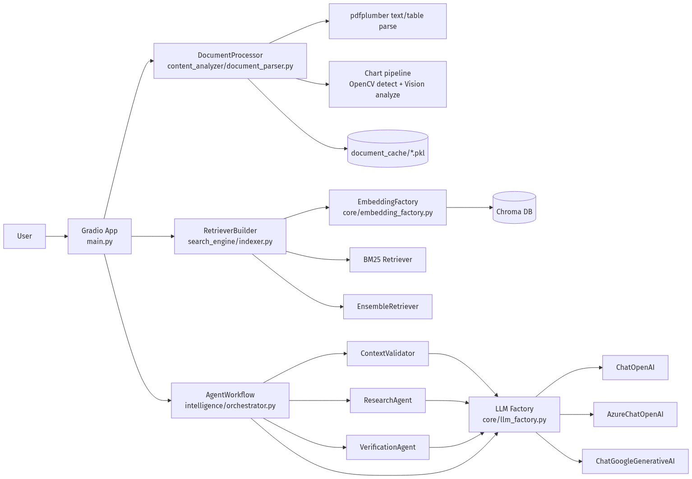
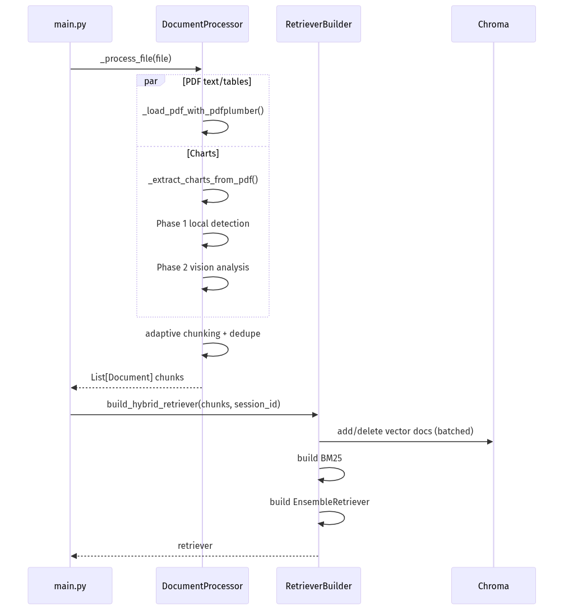
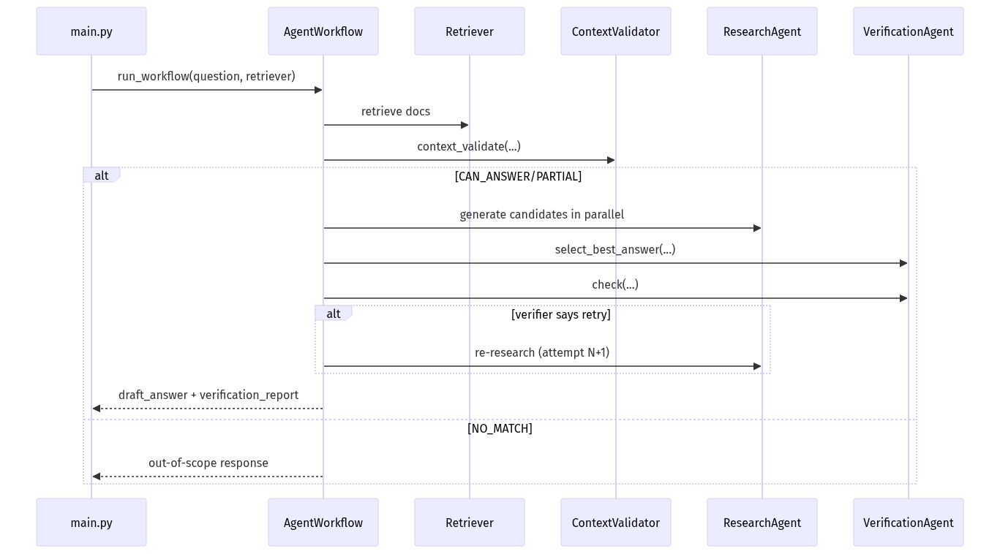
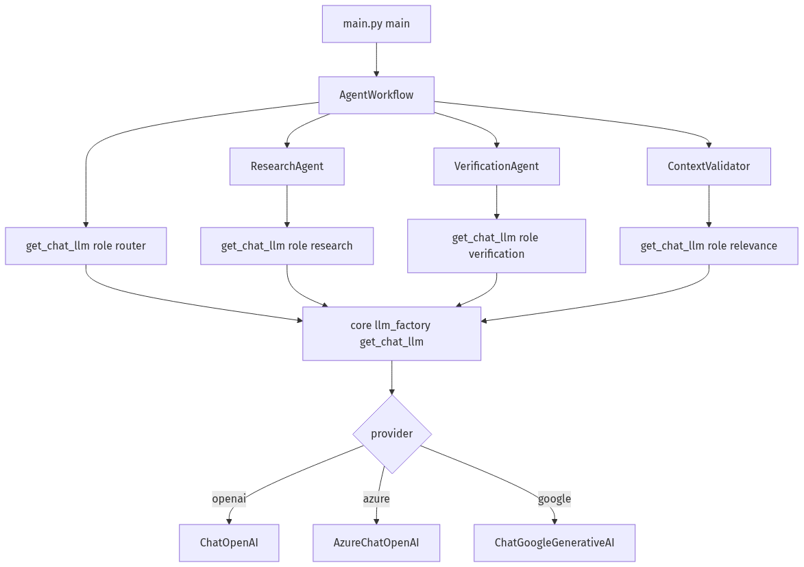
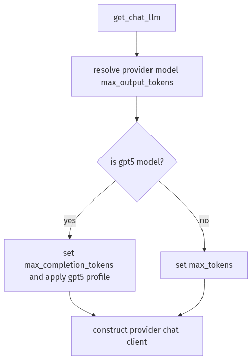
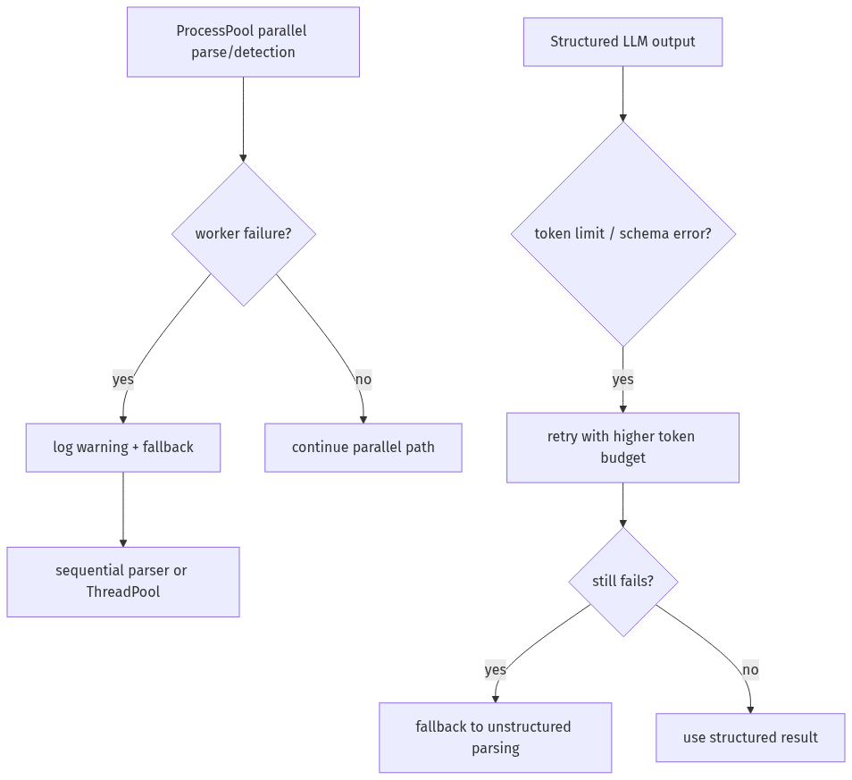

# SmartDoc AI Architecture (Static Diagrams)

If Mermaid does not render in your IDE, use this file.

For a fully self-contained view, open:
- `docs/architecture_visual.html`

---

## 1) Container / Component Diagram

[Open image directly](./diagrams/architecture_01_1-container-component-diagram.png)

---

## 2) Ingestion + Indexing Runtime Flow

[Open image directly](./diagrams/architecture_02_2-ingestion-indexing-runtime-flow.png)

---

## 3) Q&A Orchestration Flow

[Open image directly](./diagrams/architecture_03_3-q-a-orchestration-flow.png)

---

## 4) LLM Initialization Path

[Open image directly](./diagrams/architecture_04_4-llm-initialization-path-where-model-cl.png)

---

## 5) GPT-5 Path in `get_chat_llm`

[Open image directly](./diagrams/architecture_05_4-llm-initialization-path-where-model-cl.png)

---

## 6) Failure / Fallback Paths

[Open image directly](./diagrams/architecture_06_7-failure-fallback-paths.png)

