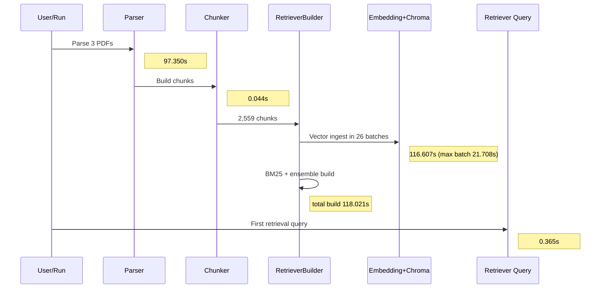
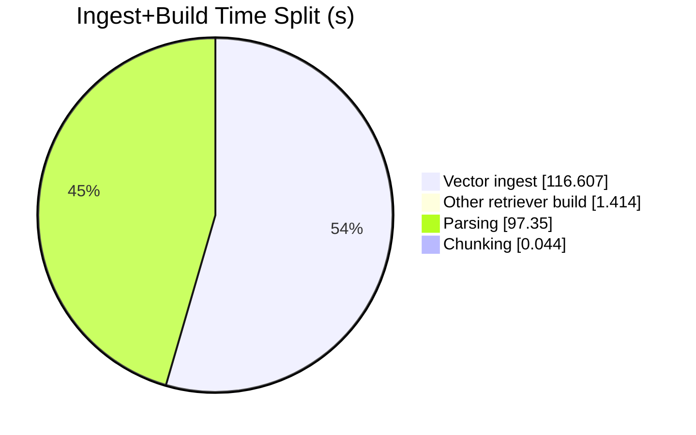

# Performance Run Report - 2026-02-14

## Scope
- Cleared chunk cache and embedding/vector artifacts.
- Verified app startup.
- Ran one end-to-end benchmark example over local sample documents.

## Reset Performed
- Deleted and recreated:
  - `document_cache/`
  - `chroma_db/`
- Before reset:
  - `document_cache`: 1,554 files, 55,268,920 bytes
  - `chroma_db`: 7 files, 28,021,688 bytes
- After reset:
  - both directories empty

## Commands Used
```bash
python main.py
python scripts/benchmark_latency.py --input-dir samples --no-large --runs 1 --label bottleneck_example --query "What is the accuracy of AI models in coding?"
```

Benchmark JSON:
- `docs/perf/benchmarks/20260214T044923Z_bottleneck_example.json`

## Measured Results (Single Run)
- Total ingest + retriever build: **215.416s**
- Parse total: **97.350s**
- Chunk total: **0.044s**
- Retriever build total: **118.021s**
- Vector ingest (inside retriever build): **116.607s**
- First retrieval query latency: **0.365s**
- Files: **3 PDFs**, docs extracted: **486**, chunks indexed: **2,559**

### Stage Share of Total (215.416s)
- Retriever build: **54.79%**
- Vector ingest only: **54.13%**
- Parsing: **45.19%**
- Chunking: **0.02%**

## Bottleneck Finding
Primary bottleneck is **embedding/vector ingest** during retriever build.

Supporting data:
- Vector ingest batches: **26** (batch size 100)
- Batch duration stats:
  - min: 2.804s
  - p50: 3.293s
  - p95: 4.552s
  - max: 21.708s (outlier)
- Outlier batches: #14 (21.708s), #1 (13.034s)

Secondary bottleneck is **PDF parsing** (not chunking):
- `samples/EnergyandAI.pdf`: 60.391s
- `samples/Digital Progress and Trends Report 2025, Strengthening AI Foundations.pdf`: 24.159s
- `samples/OIT-NASK-IAGen_WP140_web.pdf`: 12.801s

## Observations
- Benchmark stdout included repeated parser errors: `Text extraction failed ... unpack requires a buffer of 4 bytes` on many pages.
- A perf alert fired for embedding batches crossing threshold (`[ALERT] stage=embed.batch ...`).

## Data Processing Flow Diagram


## Timing Sequence Diagram


## Time Split Diagram


